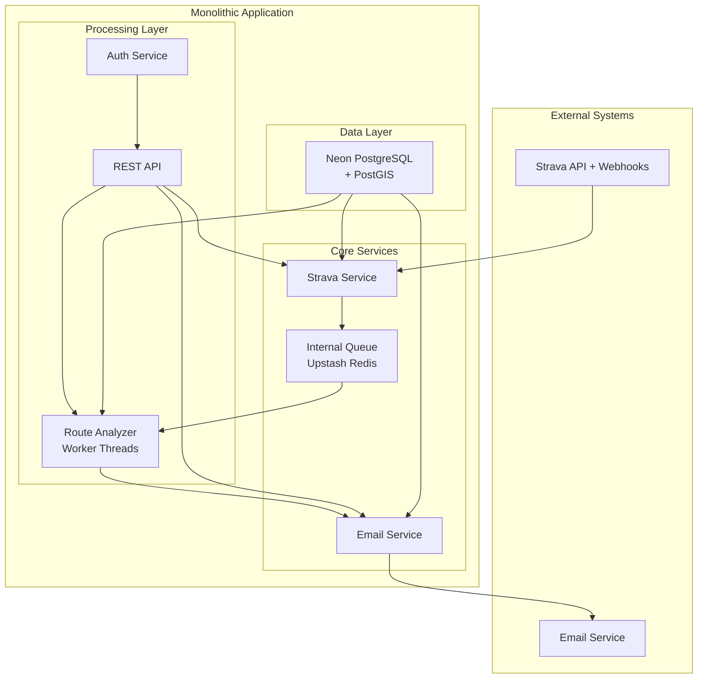

# Architecture Design

> **Document Focus**: Detailed system architecture, component design, and implementation specifics for Option 5 (Hybrid Monolith + Serverless Infrastructure). For technology choices and high-level options, see [Implementation Options](03-implementation-options.md).

## Overview

This document provides detailed system architecture and component design for the Strava Vagabond application based on our chosen Option 5: Hybrid Monolith with Internal Queues. The architecture leverages serverless infrastructure (Neon PostgreSQL + Upstash Redis) to provide a cost-effective, scalable solution that can evolve to microservices with Golang integration.

## Chosen Architecture: Option 5 - Hybrid Monolith + Serverless Infrastructure

### **Architecture Overview**



### **Technology Stack**

- **Backend**: Node.js + Express/Fastify
- **Internal Queues**: Bull + Upstash Redis (serverless)
- **Database**: Neon PostgreSQL + PostGIS (serverless)
- **Background Jobs**: Node.js worker threads
- **Deployment**: Vercel, Railway, or DigitalOcean
- **Future Evolution**: Microservices with Golang route analyzer

## Detailed Cost Analysis and Vendor Comparisons

### **Infrastructure Cost Breakdown**

#### **Development Phase (Free)**
```
Neon PostgreSQL Hobby:    $0/month
Upstash Redis Hobby:      $0/month
Local Development:         $0/month
Total:                    $0/month
```

#### **Production Phase - Budget Option**
```
Neon PostgreSQL Hobby:    $0/month (3GB storage, sufficient for 2000+ activities)
Upstash Redis Pro:        $2/month (100K requests/day)
Hosting (Railway):        $5/month
Total:                    $7/month
```

#### **Production Phase - Performance Option**
```
Neon PostgreSQL Pro:      $19/month (100GB storage, 2 vCPU)
Upstash Redis Pro:        $2/month (100K requests/day)
Hosting (Vercel Pro):     $20/month
Total:                    $41/month
```

#### **Cost Comparison with Traditional Setup**
| Component | Traditional | Neon + Upstash | Monthly Savings |
|-----------|-------------|----------------|-----------------|
| **PostgreSQL** | $15-25/month | $0-19/month | $15-25/month |
| **Redis** | $15-30/month | $0.20-2/month | $13-28/month |
| **Hosting** | $5-15/month | $5-20/month | $0-5/month |
| **Total** | **$35-70/month** | **$5.20-41/month** | **$30-100/month** |

### **Upstash Redis Detailed Analysis**

#### **Why Upstash is Perfect for Our Use Case**
- **Serverless Redis**: No infrastructure management required
- **Pay-per-request**: Only pay for actual usage (perfect for personal projects)
- **Global Edge Locations**: Low latency worldwide
- **Built-in Persistence**: Automatic backups and data durability
- **Bull Queue Native Support**: Seamless integration with Node.js Bull

#### **Implementation Advantages**
- **Zero Maintenance**: No Redis server setup, monitoring, or scaling
- **Environment Parity**: Same Redis instance in development and production
- **Automatic Scaling**: Handles Strava webhook bursts without capacity planning
- **Production Ready**: 99.9% uptime SLA, enterprise-grade reliability

#### **Cost Comparison with Redis Alternatives**
| Redis Service | Monthly Cost | Setup Complexity | Maintenance | **Best For** |
|---------------|--------------|------------------|-------------|--------------|
| **Upstash Hobby** | $0 | Zero | Zero | **Development** |
| **Upstash Pro** | $2 | Zero | Zero | **Production** |
| **DigitalOcean** | $15 | Medium | Low | Traditional hosting |
| **Heroku** | $10-30 | Low | Low | Heroku ecosystem |
| **AWS ElastiCache** | $15-30 | High | Medium | AWS enterprise |

#### **Free Tier Coverage**
- **10,000 requests/day**: Sufficient for 2000+ activities
- **256MB storage**: Adequate for queue management
- **Unlimited connections**: No connection pooling limits
- **Global edge**: Low latency worldwide

### **Neon PostgreSQL Detailed Analysis**

#### **Why Neon is Perfect for Our Use Case**
- **100% PostgreSQL Compatible**: No feature limitations or vendor lock-in
- **Full PostGIS Support**: Complete spatial database capabilities for route analysis
- **Serverless Architecture**: Pay-per-compute, scales to zero when not in use
- **Database Branching**: Create instant copies for development and testing
- **Global Edge Locations**: Low latency worldwide with automatic failover

#### **PostGIS Capabilities for Route Analysis**
- **Spatial Data Types**: Full support for POINT, LINESTRING, POLYGON
- **Spatial Indexing**: GIST indexes for fast geometric queries
- **Advanced Functions**: ST_Distance, ST_HausdorffDistance, ST_Within
- **Route Similarity**: Can implement proper geometric algorithms instead of grid-based hashing
- **Performance**: Optimized for spatial operations with connection pooling

#### **Cost Comparison with Database Alternatives**
| Database Service | Monthly Cost | PostGIS | Storage | Compute | **Best For** |
|------------------|--------------|---------|---------|---------|--------------|
| **Neon Hobby** | $0 | ✅ Full | 3GB | 0.5 vCPU | **Development** |
| **Neon Pro** | $19 | ✅ Full | 100GB | 2 vCPU | **Production** |
| **Vercel Postgres** | $0-20 | ✅ Full | 256MB-8GB | Limited | Vercel ecosystem |
| **Supabase** | $25 | ✅ Full | 8GB | Shared | Full-stack solution |
| **AWS RDS** | $12-25 | ✅ Full | Variable | Variable | Enterprise AWS |

#### **Implementation Advantages**
- **Zero Maintenance**: No database server setup, monitoring, or scaling
- **Environment Parity**: Same database capabilities in development and production
- **Automatic Scaling**: Handles 2000+ activities without capacity planning
- **Production Ready**: 99.9% uptime, automatic backups, point-in-time recovery
- **Developer Experience**: CLI tools, branching, easy migrations

#### **Free Tier Coverage**
- **3GB storage**: Sufficient for 2000+ activities with GPS data
- **0.5 vCPU**: Adequate for development and light production
- **Unlimited connections**: No connection pooling limits
- **Database branching**: Instant copies for testing

## System Architecture Components

### **1. Core Application Layer**

#### **Strava Service**
- **Purpose**: Handle Strava API integration and webhook processing
- **Responsibilities**:
  - OAuth authentication with Strava
  - Fetch user activities and GPS data
  - Process incoming webhooks
  - Queue new activities for analysis
- **Technology**: Node.js with Strava API client
- **Error Handling**: Rate limiting, retry logic, webhook validation

#### **Route Analyzer Service**
- **Purpose**: Process GPS data and determine route uniqueness
- **Responsibilities**:
  - Parse GPS coordinates from Strava activities
  - Implement PostGIS geometric algorithms for route similarity
  - Calculate uniqueness percentages
  - Store route segments in database
- **Technology**: Node.js worker threads with PostGIS integration
- **Performance**: Optimized for spatial queries and geometric calculations

#### **Email Service**
- **Purpose**: Generate and send ride summary emails
- **Responsibilities**:
  - Create personalized ride summaries
  - Calculate statistics and insights
  - Handle email delivery and tracking
  - Manage email preferences
- **Technology**: Node.js with email templating and delivery
- **Integration**: Can use user's Strava email or custom email

### **2. Queue Management Layer**

#### **Internal Queue System**
- **Technology**: Bull + Upstash Redis
- **Queue Types**:
  - **Activity Queue**: New activities from Strava webhooks
  - **Analysis Queue**: Route analysis jobs
  - **Email Queue**: Email generation jobs
- **Processing**: Worker threads with configurable concurrency
- **Error Handling**: Dead letter queues, retry logic, job monitoring

#### **Queue Flow**
```
Strava Webhook → Activity Queue → Route Analysis → Email Queue → Email Service
     ↓              ↓              ↓              ↓              ↓
  Immediate      Background      Background      Background      Background
  Response      Processing      Processing      Processing      Processing
```

### **3. Data Layer**

#### **Neon PostgreSQL Schema**
- **Users Table**: Strava user information and preferences
- **Activities Table**: Strava activity metadata and GPS data
- **Routes Table**: Processed route segments with PostGIS geometry
- **Route_Segments Table**: Individual GPS segments for similarity analysis
- **Email_Logs Table**: Email delivery tracking and preferences

#### **PostGIS Spatial Design**
```sql
-- Route storage with spatial indexing
CREATE TABLE routes (
  id SERIAL PRIMARY KEY,
  user_id INTEGER REFERENCES users(id),
  activity_id INTEGER REFERENCES activities(id),
  geometry GEOMETRY(LINESTRING, 4326),
  uniqueness_score DECIMAL(5,2),
  created_at TIMESTAMP DEFAULT NOW()
);

-- Spatial index for fast route queries
CREATE INDEX routes_geometry_idx ON routes USING GIST (geometry);

-- Route similarity query example
SELECT id, ST_HausdorffDistance(geometry, ST_GeomFromText('LINESTRING(...)', 4326)) as similarity
FROM routes
WHERE user_id = $1
ORDER BY similarity;
```

### **4. API Layer**

#### **API Overview**
- **Purpose**: REST API for external access and internal service communication
- **Technology**: Express/Fastify with OpenAPI 3.0 specification
- **Architecture**: Single API layer serving all internal services
- **Future**: Will evolve to API Gateway pattern in microservices phase

> **Note**: Detailed API endpoints, schemas, and authentication will be covered in the [API Design](05-api-design.md) section.

## Migration Path to Microservices with Golang

### **Phase 1: Monolith with Queues (Current)**
- **Architecture**: Single Node.js service with internal queues
- **Benefits**: Simple development, easy debugging, cost-effective
- **Learning**: Queue patterns, worker threads, PostGIS integration

### **Phase 2: Extract Route Analyzer**
- **Goal**: Move route analysis to separate service
- **Technology**: Golang service with PostGIS driver
- **Benefits**: 
  - Learn Golang for performance-critical operations
  - Experience service-to-service communication
  - Maintain single database for data consistency
- **Implementation**: 
  - Extract route analysis logic to Golang service
  - Implement gRPC or HTTP communication
  - Keep shared Neon PostgreSQL database

### **Phase 3: Full Microservices**
- **Goal**: Complete microservices architecture
- **Services**:
  - **API Gateway**: Node.js (your expertise)
  - **Route Analyzer**: Golang (learning + performance)
  - **Activity Processor**: Node.js (strava integration)
  - **Email Service**: Node.js (email handling)
- **Infrastructure**: 
  - **Queues**: Migrate from Upstash to AWS SQS
  - **Database**: Keep Neon PostgreSQL (shared)
  - **Deployment**: Docker containers with orchestration
- **Learning Outcomes**:
  - **Golang Expertise**: Route analysis and geometric algorithms
  - **Microservices Patterns**: Service discovery, communication, monitoring
  - **Distributed Systems**: Data consistency, error handling, scaling

### **Why This Migration Path is Perfect**
1. **Gradual Learning**: Start simple, add complexity incrementally
2. **Golang Focus**: Learn Golang in a controlled, focused way
3. **Career Development**: Microservices + Golang = valuable skills
4. **Performance Benefits**: Golang excels at CPU-intensive geometric calculations
5. **Cost Efficiency**: Start with free tiers, scale as needed

## Performance Characteristics

### **Route Analysis Performance**
- **Current (Node.js)**: ~100-400ms per activity
- **Phase 2 (Golang)**: ~50-200ms per activity
- **Phase 3 (Optimized)**: ~25-100ms per activity
- **Improvement**: 2-4x performance boost with Golang

### **Database Performance**
- **PostGIS Queries**: O(log n) with spatial indexing
- **Route Similarity**: O(n) for analysis, O(log n) for lookups
- **Concurrent Processing**: Limited by worker thread count
- **Memory Usage**: ~300-600MB for typical workload

### **Scalability Characteristics**
- **Current**: Single service, limited by Node.js event loop
- **Phase 2**: Two services, better resource utilization
- **Phase 3**: Multiple services, independent scaling
- **Infrastructure**: Serverless database and queues scale automatically

## Security and Privacy

### **Security Overview**
- **Authentication**: Strava OAuth integration with JWT token management
- **Data Protection**: TLS encryption for all communications
- **Infrastructure Security**: Serverless services with built-in security
- **Future Considerations**: Will implement additional security measures in dedicated section

> **Note**: Detailed security requirements, PII handling, and compliance will be covered in the [Security & Privacy](08-security-privacy.md) section.

## Monitoring and Observability

### **Monitoring Overview**
- **Application Metrics**: Queue performance, database queries, API response times
- **Infrastructure Metrics**: Serverless service usage, storage growth, performance
- **Business Metrics**: Route analysis accuracy, user engagement patterns
- **Future Implementation**: Will implement comprehensive monitoring in dedicated section

> **Note**: Detailed monitoring strategy, metrics, and alerting will be covered in the [Observability](09-observability.md) section.

## Next Steps

1. **Data Model Design**: Complete ERD and database schema (next section)
2. **API Specification**: OpenAPI documentation and endpoint design
3. **Integration Design**: Strava API integration and webhook handling
4. **Security & Privacy**: Detailed security requirements and compliance
5. **Observability**: Monitoring, metrics, and alerting strategy
6. **Implementation Plan**: Development phases and technical roadmap

## References

- [Neon PostgreSQL Documentation](https://neon.tech/docs)
- [Upstash Redis Documentation](https://docs.upstash.com/redis)
- [PostGIS Spatial Functions](https://postgis.net/docs/reference.html)
- [Bull Queue Documentation](https://github.com/OptimalBits/bull)
- [Node.js Worker Threads](https://nodejs.org/api/worker_threads.html)
- [Golang PostGIS Driver](https://github.com/lib/pq)
- [Microservices Patterns](https://microservices.io/patterns/)
