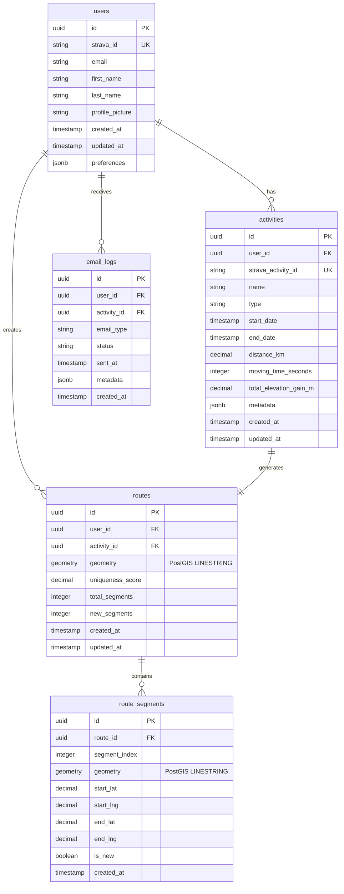

# Data Model

> **Document Focus**: Entity relationships, database schema design, and data storage strategies. For system architecture and component design, see [Architecture Design](04-architecture-design.md). For API endpoints and schemas, see [API Design](06-api-design.md).

## Overview

This document defines the data model for the Strava Vagabond application, focusing on efficient storage and retrieval of GPS data, route analysis results, and user information. The design leverages PostgreSQL with PostGIS extensions for spatial data management and route similarity analysis.

## Database Technology

### **Primary Database**: Neon PostgreSQL + PostGIS
- **Spatial Extensions**: Full PostGIS support for geometric operations
- **Performance**: GIST spatial indexing for fast route queries
- **Scalability**: Serverless architecture with automatic scaling
- **Features**: Database branching, point-in-time recovery, global edge locations

### **UUID Primary Keys**
- **Security**: No sequential ID enumeration attacks
- **Distribution**: Globally unique across all environments
- **Integration**: Easy to merge data from different sources
- **Scalability**: No integer overflow concerns
- **Privacy**: IDs don't reveal user count or creation order

### **Key PostGIS Capabilities**
- **Spatial Data Types**: POINT, LINESTRING, POLYGON
- **Spatial Functions**: ST_Distance, ST_HausdorffDistance, ST_Within
- **Spatial Indexing**: GIST indexes for geometric queries
- **Coordinate Systems**: SRID 4326 (WGS84) for GPS coordinates

## Entity Relationship Diagram (ERD)



## Database Schema Design

### **Database Setup**

```sql
-- Enable UUID extension for gen_random_uuid() function
CREATE EXTENSION IF NOT EXISTS "uuid-ossp";

-- Enable PostGIS extension for spatial data
CREATE EXTENSION IF NOT EXISTS postgis;
```

### **1. Users Table**

```sql
CREATE TABLE users (
    id UUID PRIMARY KEY DEFAULT gen_random_uuid(),
    strava_id VARCHAR(50) UNIQUE NOT NULL,
    email VARCHAR(255) NOT NULL,
    preferences JSONB DEFAULT '{}', -- Email preferences, notification settings, etc.
    created_at TIMESTAMP DEFAULT NOW(),
    updated_at TIMESTAMP DEFAULT NOW()
);

-- Index for Strava ID lookups
CREATE INDEX idx_users_strava_id ON users(strava_id);

-- Index for email lookups
CREATE INDEX idx_users_email ON users(email);
```

**Purpose**: Store essential user information for Strava integration
**Key Features**: 
- Strava ID for API integration
- Email for notifications and user identification
- JSONB preferences for email settings and future features
- Timestamps for audit trail

### **2. Activities Table**

```sql
CREATE TABLE activities (
    id UUID PRIMARY KEY DEFAULT gen_random_uuid(),
    user_id UUID REFERENCES users(id) ON DELETE CASCADE,
    strava_activity_id VARCHAR(50) UNIQUE NOT NULL,
    name VARCHAR(255) NOT NULL,
    type VARCHAR(50) NOT NULL,
    start_date TIMESTAMP NOT NULL,
    distance_m DECIMAL(10,2) NOT NULL,
    total_elevation_gain_m DECIMAL(8,2),
    elapsed_time INTEGER NOT NULL,
    moving_time INTEGER NOT NULL,
    metadata JSONB DEFAULT '{}', -- Store other Strava fields we don't explicitly need
    created_at TIMESTAMP DEFAULT NOW(),
    updated_at TIMESTAMP DEFAULT NOW()
);

-- Index for user activity lookups
CREATE INDEX idx_activities_user_id ON activities(user_id);

-- Index for date range queries
CREATE INDEX idx_activities_start_date ON activities(start_date);

-- Index for Strava activity ID lookups
CREATE INDEX idx_activities_strava_id ON activities(strava_activity_id);

-- Composite index for user + date queries
CREATE INDEX idx_activities_user_date ON activities(user_id, start_date);
```

**Purpose**: Store Strava activity metadata and basic information
**Key Features**:
- Strava activity ID for API synchronization
- Comprehensive activity metadata aligned with Strava API
- JSONB field for additional Strava data and future extensions
- Efficient indexing for common queries

**Core Features Support**:
- **Route Analysis**: name, type, start_date for activity identification
- **Distance Tracking**: distance_m for route length calculations
- **Elevation Data**: total_elevation_gain_m for route difficulty
- **Time Metrics**: elapsed_time, moving_time for performance tracking

**Metadata JSONB Content**:
- **Strava Fields**: Store other Strava data we don't explicitly need
- **Future Extensibility**: Easy to add new fields without schema changes
- **Data Preservation**: Keep all Strava data for potential future use

### **3. Routes Table**

```sql
CREATE TABLE routes (
    id UUID PRIMARY KEY DEFAULT gen_random_uuid(),
    user_id UUID REFERENCES users(id) ON DELETE CASCADE,
    activity_id UUID REFERENCES activities(id) ON DELETE CASCADE,
    geometry GEOMETRY(LINESTRING, 4326) NOT NULL,
    uniqueness_score DECIMAL(5,2) NOT NULL,
    total_segments INTEGER NOT NULL DEFAULT 0,
    new_segments INTEGER NOT NULL DEFAULT 0,
    created_at TIMESTAMP DEFAULT NOW(),
    updated_at TIMESTAMP DEFAULT NOW()
);

-- Spatial index for fast geometric queries
CREATE INDEX idx_routes_geometry ON routes USING GIST (geometry);

-- Index for user route lookups
CREATE INDEX idx_routes_user_id ON routes(user_id);

-- Index for activity route lookups
CREATE INDEX idx_routes_activity_id ON routes(activity_id);

-- Index for uniqueness score queries
CREATE INDEX idx_routes_uniqueness ON routes(uniqueness_score);

-- Composite index for user + uniqueness queries
CREATE INDEX idx_routes_user_uniqueness ON routes(user_id, uniqueness_score);
```

**Purpose**: Store processed route data with PostGIS geometry
**Key Features**:
- PostGIS LINESTRING for GPS coordinate storage
- Uniqueness score for route analysis results
- Segment counting for detailed analysis
- Spatial indexing for fast geometric queries

### **4. Route Segments Table**

```sql
CREATE TABLE route_segments (
    id UUID PRIMARY KEY DEFAULT gen_random_uuid(),
    route_id UUID REFERENCES routes(id) ON DELETE CASCADE,
    segment_index INTEGER NOT NULL,
    geometry GEOMETRY(LINESTRING, 4326) NOT NULL,
    start_lat DECIMAL(10,8) NOT NULL,
    start_lng DECIMAL(11,8) NOT NULL,
    end_lat DECIMAL(10,8) NOT NULL,
    end_lng DECIMAL(11,8) NOT NULL,
    is_new BOOLEAN NOT NULL DEFAULT false,
    created_at TIMESTAMP DEFAULT NOW()
);

-- Spatial index for segment geometric queries
CREATE INDEX idx_route_segments_geometry ON route_segments USING GIST (geometry);

-- Index for route segment lookups
CREATE INDEX idx_route_segments_route_id ON route_segments(route_id);

-- Index for new segment queries
CREATE INDEX idx_route_segments_is_new ON route_segments(is_new);

-- Composite index for route + segment order
CREATE INDEX idx_route_segments_route_order ON route_segments(route_id, segment_index);
```

**Purpose**: Store individual route segments for detailed analysis
**Key Features**:
- Segment-level geometry for precise analysis
- New segment identification for uniqueness tracking
- Coordinate storage for quick access
- Spatial indexing for geometric operations

### **5. Email Logs Table**

```sql
CREATE TABLE email_logs (
    id UUID PRIMARY KEY DEFAULT gen_random_uuid(),
    user_id UUID REFERENCES users(id) ON DELETE CASCADE,
    activity_id UUID REFERENCES activities(id) ON DELETE SET NULL,
    email_type VARCHAR(50) NOT NULL,
    status VARCHAR(50) NOT NULL,
    sent_at TIMESTAMP,
    metadata JSONB DEFAULT '{}',
    created_at TIMESTAMP DEFAULT NOW()
);

-- Index for user email lookups
CREATE INDEX idx_email_logs_user_id ON email_logs(user_id);

-- Index for email type queries
CREATE INDEX idx_email_logs_type ON email_logs(email_type);

-- Index for status queries
CREATE INDEX idx_email_logs_status ON email_logs(status);

-- Composite index for user + type queries
CREATE INDEX idx_email_logs_user_type ON email_logs(user_id, email_type);
```

**Purpose**: Track email delivery and user preferences
**Key Features**:
- Email delivery tracking
- User notification preferences
- Activity-specific email logs
- JSONB metadata for flexible tracking

## Spatial Data Design

### **PostGIS Geometry Storage**

#### **Route Geometry (LINESTRING)**
```sql
-- Example route geometry insertion
INSERT INTO routes (user_id, activity_id, geometry, uniqueness_score, total_segments, new_segments)
VALUES (
    'a0eebc99-9c0b-4ef8-bb6d-6bb9bd380a11', 
    'b0eebc99-9c0b-4ef8-bb6d-6bb9bd380a12', 
    ST_GeomFromText('LINESTRING(-122.4194 37.7749, -122.4184 37.7759, -122.4174 37.7769)', 4326),
    75.50,
    150,
    113
);
```

#### **Segment Geometry (LINESTRING)**
```sql
-- Example segment geometry insertion
INSERT INTO route_segments (route_id, segment_index, geometry, start_lat, start_lng, end_lat, end_lng, is_new)
VALUES (
    'c0eebc99-9c0b-4ef8-bb6d-6bb9bd380a13',
    1,
    ST_GeomFromText('LINESTRING(-122.4194 37.7749, -122.4184 37.7759)', 4326),
    37.7749,
    -122.4194,
    37.7759,
    -122.4184,
    true
);
```

### **Spatial Indexing Strategy**

#### **GIST Index Benefits**
- **Fast Geometric Queries**: O(log n) complexity for spatial operations
- **Efficient Range Searches**: Quick bounding box and distance queries
- **Optimized Joins**: Fast spatial relationship operations
- **Automatic Maintenance**: PostgreSQL handles index updates

#### **Index Usage Examples**
```sql
-- Find routes within bounding box
SELECT id, uniqueness_score 
FROM routes 
WHERE ST_Within(geometry, ST_MakeEnvelope(-122.5, 37.7, -122.3, 37.8, 4326));

-- Find routes near a point (within 1km)
SELECT id, ST_Distance(geometry, ST_Point(-122.4194, 37.7749, 4326)) as distance
FROM routes 
WHERE ST_DWithin(geometry, ST_Point(-122.4194, 37.7749, 4326), 1000)
ORDER BY distance;
```

## Strava API Integration

### **API Data Mapping**

#### **Activity Data from Strava API**
The [Strava API getActivityById endpoint](https://developers.strava.com/docs/reference/#api-Activities-getActivityById) provides comprehensive activity information. We store only essential fields for our core features:

- **Core Fields**: name, type, start_date, distance, elapsed_time, moving_time
- **Route Analysis**: total_elevation_gain_m for route difficulty assessment
- **Metadata Storage**: All other Strava data stored in JSONB for future use

#### **GPS Data Handling**
Strava provides GPS data in multiple formats:
- **Polyline Map**: Encoded polyline string for route visualization
- **Activity Streams**: Detailed GPS coordinates with additional metrics
- **Summary Polyline**: Simplified route representation

#### **Data Processing Strategy**
1. **Fetch Activity**: Use getActivityById for metadata
2. **Fetch GPS Stream**: Use getActivityStreams for detailed coordinates
3. **Process Coordinates**: Convert to PostGIS LINESTRING geometry
4. **Store Results**: Save processed geometry and analysis results

## Data Storage Strategies

### **1. GPS Data Processing**

#### **Coordinate Storage**
- **Format**: WGS84 (SRID 4326) for global compatibility
- **Precision**: 8 decimal places for lat/lng (sub-meter accuracy)
- **Compression**: PostGIS handles coordinate compression automatically
- **Validation**: ST_IsValid() ensures geometric integrity

#### **Route Segmentation**
- **Strategy**: Divide routes into manageable segments (50-100 coordinates)
- **Benefits**: Faster similarity analysis, better memory management
- **Trade-offs**: Slight accuracy loss at segment boundaries
- **Implementation**: Use PostGIS ST_Subdivide() for automatic segmentation

### **2. Route Similarity Analysis**

#### **Similarity Algorithms**
```sql
-- Hausdorff Distance for route similarity
SELECT r1.id, r2.id, ST_HausdorffDistance(r1.geometry, r2.geometry) as similarity
FROM routes r1, routes r2
WHERE r1.user_id = $1 AND r2.user_id = $1 AND r1.id != r2.id
ORDER BY similarity;

-- Distance-based similarity
SELECT r1.id, r2.id, ST_Distance(r1.geometry, r2.geometry) as distance
FROM routes r1, routes r2
WHERE r1.user_id = $1 AND r2.user_id = $1 AND r1.id != r2.id
ORDER BY distance;
```

#### **Performance Optimization**
- **Spatial Indexing**: GIST indexes for fast geometric queries
- **Query Optimization**: Use EXPLAIN ANALYZE for query tuning
- **Batch Processing**: Process multiple routes in single queries
- **Caching**: Redis caching for frequently accessed similarity results

### **3. Data Retention and Archiving**

#### **Retention Strategy**
- **Active Data**: Keep last 2 years of routes and activities
- **Archive Strategy**: Move older data to separate tables
- **Backup Policy**: Daily backups with point-in-time recovery
- **Cleanup Jobs**: Automated cleanup of old email logs and metadata

#### **Archive Tables**
```sql
-- Archive tables for old data
CREATE TABLE routes_archive (LIKE routes INCLUDING ALL);
CREATE TABLE activities_archive (LIKE activities INCLUDING ALL);

-- Partitioning strategy for large datasets
CREATE TABLE routes_partitioned (
    LIKE routes INCLUDING ALL
) PARTITION BY RANGE (created_at);
```

## Data Migration Considerations

### **1. Schema Evolution**

#### **Version Control**
- **Migration Files**: Numbered SQL migration scripts
- **Rollback Strategy**: Down migrations for each change
- **Testing**: Test migrations on copy of production data
- **Documentation**: Document all schema changes

#### **Example Migration**
```sql
-- Migration: Add uniqueness_score to routes table
-- Up migration
ALTER TABLE routes ADD COLUMN uniqueness_score DECIMAL(5,2);
UPDATE routes SET uniqueness_score = 0.0 WHERE uniqueness_score IS NULL;
ALTER TABLE routes ALTER COLUMN uniqueness_score SET NOT NULL;

-- Down migration
ALTER TABLE routes DROP COLUMN uniqueness_score;
```

### **2. Data Migration Tools**

#### **Recommended Tools**
- **Node.js**: node-pg-migrate for migration management
- **PostgreSQL**: Native ALTER TABLE for simple changes
- **PostGIS**: ST_Transform() for coordinate system changes
- **Backup**: pg_dump/pg_restore for major schema changes

#### **Migration Process**
1. **Development**: Test migrations on development database
2. **Staging**: Validate migrations on staging environment
3. **Production**: Execute migrations during maintenance window
4. **Verification**: Confirm data integrity after migration

## Performance Considerations

### **1. Query Optimization**

#### **Common Query Patterns**
- **User Routes**: `SELECT * FROM routes WHERE user_id = $1 ORDER BY created_at DESC`
- **Route Similarity**: Spatial queries with GIST indexes
- **Activity History**: Date-range queries with composite indexes
- **Email Tracking**: User + type composite indexes

#### **Performance Monitoring**
- **Query Analysis**: Use EXPLAIN ANALYZE for slow queries
- **Index Usage**: Monitor index hit rates and usage
- **Table Statistics**: Regular ANALYZE for query planner
- **Connection Pooling**: Manage database connections efficiently

### **2. Scaling Considerations**

#### **Current Capacity**
- **Users**: Designed for single user initially, scalable to 100+
- **Activities**: Optimized for 2000+ activities per user
- **Routes**: Efficient storage for 1000+ routes per user
- **Segments**: Fast analysis of 50,000+ route segments

#### **Future Scaling**
- **Partitioning**: Route tables by date for large datasets
- **Read Replicas**: Separate read/write databases for high traffic
- **Caching**: Redis caching for frequently accessed data
- **CDN**: Static route visualization data on CDN

## Security and Privacy

### **1. Data Protection**

#### **Access Control**
- **Row-Level Security**: Users can only access their own data
- **Connection Encryption**: TLS for all database connections
- **Authentication**: Strong password policies and connection limits
- **Audit Logging**: Track all database access and changes

#### **Privacy Measures**
- **Data Minimization**: Store only necessary GPS information
- **User Control**: Allow users to delete their data
- **GDPR Compliance**: Right to be forgotten implementation
- **Data Retention**: Clear data lifecycle policies

### **2. Backup and Recovery**

#### **Backup Strategy**
- **Frequency**: Daily automated backups
- **Retention**: 30 days of daily backups, 12 months of weekly backups
- **Testing**: Monthly backup restoration testing
- **Monitoring**: Backup success/failure monitoring and alerting

## Next Steps

1. **Schema Implementation**: Create database schema and indexes
2. **Migration Setup**: Configure migration tools and processes
3. **Data Validation**: Test schema with sample Strava data
4. **Performance Testing**: Benchmark spatial queries and similarity analysis
5. **Security Review**: Validate access controls and data protection

## References

- [PostGIS Documentation](https://postgis.net/docs/)
- [PostgreSQL Spatial Extensions](https://www.postgresql.org/docs/current/postgis.html)
- [Neon PostgreSQL Documentation](https://neon.tech/docs)
- [PostGIS Spatial Functions](https://postgis.net/docs/reference.html)
- [Database Migration Best Practices](https://www.postgresql.org/docs/current/ddl.html)
